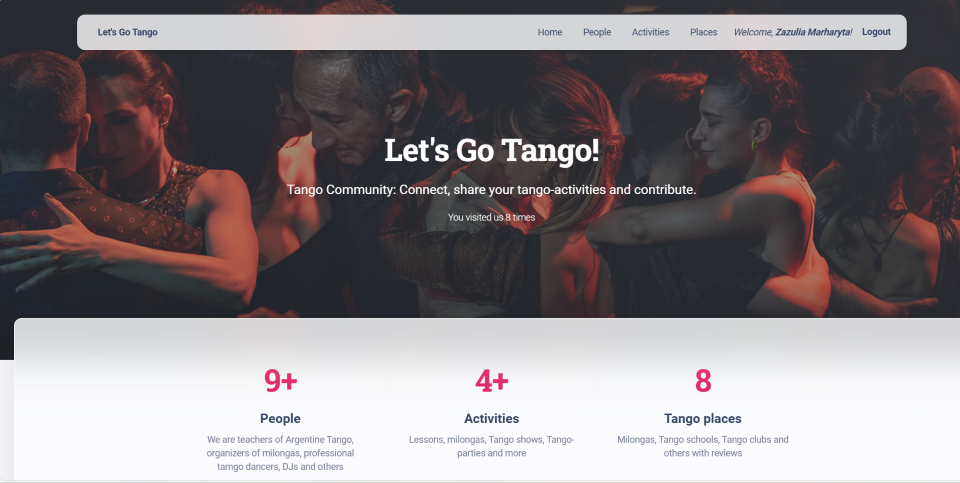

# Let's Go Tango Project
> Tango Community: Connect, share your tango-activities and contribute.

If you dance Tango or are just learning to dance, you can become a user of this website, 
and you can be one of the members of the Tango community. 
You will have access to information about other members, 
all kinds of Tango activities and places where Tango events are held.

## Check it out!

[Let's Go Tango Project deployed to Render](https://lets_go_tango.render.com/)

## Installing

Python3 must be already installed

```shell
git clone https://github.com/zazmarga/lets-go-tango
cd lets_go_tango
python3 -m venv venv
source venv/bin/activate
pip install -r requirements.txt
python manage.py migrate
python manage.py createsuperuser
python manage.py runserver  # starts Django server
```

You can launch the website and log in with your superuser data.

## Getting started

At the moment of registration of the first member, the occupation "Tanguero" will be created.

## Features

* Authentication feature for members/users
* Managing directly from the website interface
  - Tango activities, 
  - member data (own data only), 
  - categories, 
  - professions 
  - locations
* Powerful admin panel for advanced management

## Demo


